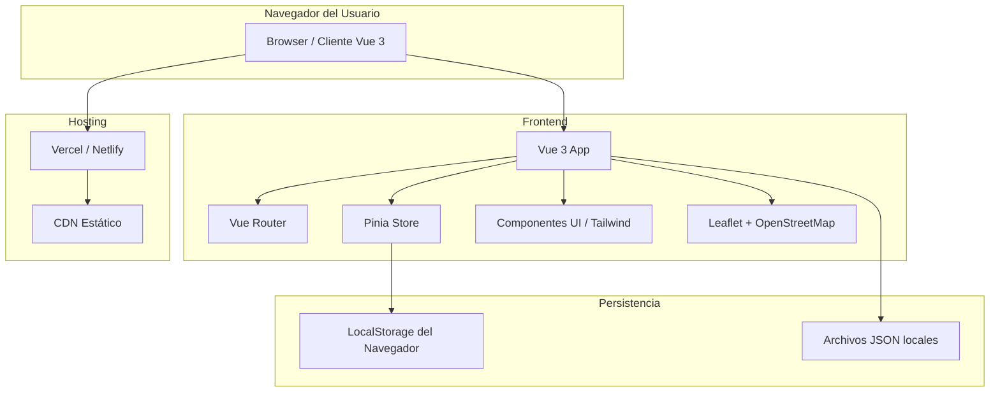
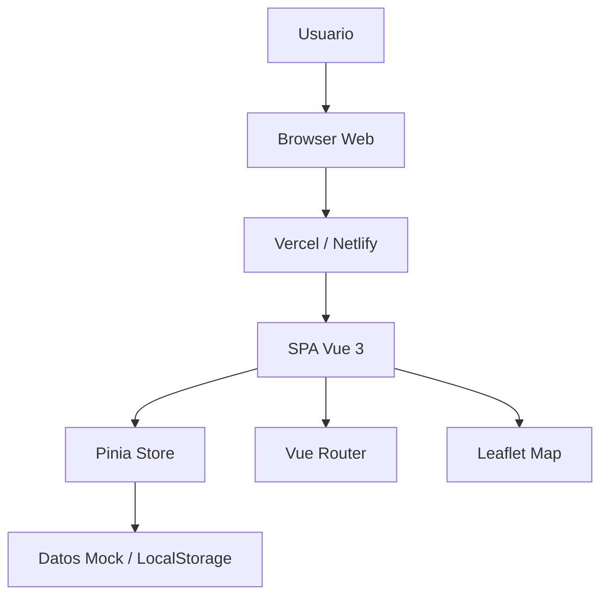
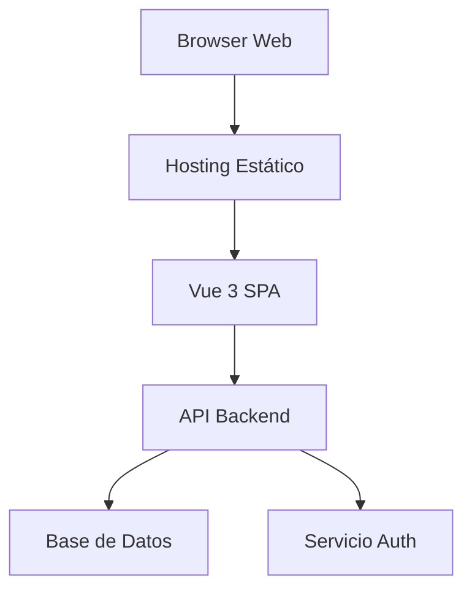

# UML de Nodos - Arquitectura de Despliegue

## 1. Introducción

Este documento complementa la documentación de arquitectura con una vista de **UML de nodos** (deployment nodes). Está pensado para mostrar cómo se relacionan los componentes del prototipo frente a la infraestructura, aún cuando la primera fase solo se implemente como frontend.

> Nota: En esta fase el backend se simula con datos locales y `LocalStorage`. En la fase 2 se puede agregar un nodo backend real.

---

## 2. Diagrama de Nodos (Deployment)

---

## 3. Descripción de Nodos

### 3.1 Navegador del Usuario
- Cliente que carga la SPA generada por Vite.
- Ejecuta la aplicación Vue 3 en el dispositivo del usuario.

### 3.2 Nodo Frontend
- **Vue 3 App**: aplicación principal con vistas y componentes.
- **Vue Router**: enrutamiento entre módulos.
- **Pinia Store**: capa de estado global.
- **Tailwind CSS/UI**: estilos y diseño.
- **Leaflet + OpenStreetMap**: representación cartográfica.

### 3.3 Nodo de Persistencia Local
- **LocalStorage**: almacenamiento de sesión, datos guardados y estados persistentes.
- **Archivos JSON locales**: datos iniciales simulados para usuarios, alimentos, cursos y zonas.

### 3.4 Nodo de Hosting
- **Vercel / Netlify**: hosting estático de la aplicación.
- **CDN**: entrega rápida de los assets.

---

## 4. Diagrama de Container / Nodo Técnico

---

## 5. Nodo Futuro: Backend / API

Si se escala a una fase posterior, el diagrama de nodos se actualizaría con los siguientes elementos:

- **API Backend** (Node.js / Express / Fastify)
- **Base de Datos** (PostgreSQL, MongoDB, etc.)
- **Sistema de Autenticación** (JWT, OAuth)
- **Servicios externos** (Email, notificaciones, geocoding)

---

## 6. Recomendación

Sí, en una arquitectura de sistema bien definida **es útil incluir UML de nodos**. Esto ayuda a:

- Visualizar dónde se ejecuta cada componente.
- Entender la separación entre frontend, persistencia y hosting.
- Preparar el salto a backend real.

Este documento aporta esa vista y puede usarse directamente en la presentación o como referencia técnica.
