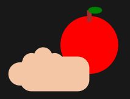

# 🌍 RedAlimenta – Plataforma de Rescate Alimentario e Inclusión Productiva

<p align="center">
  
</p>

## 🧠 Descripción

**RedAlimenta** es una plataforma digital desarrollada como prototipo funcional de alta fidelidad que busca combatir el hambre y la pobreza en zonas urbanas mediante el uso estratégico de la tecnología.

La solución conecta comercios que tienen excedentes de alimentos próximos a perecer (pero aptos para consumo) con organizaciones comunitarias y líderes sociales, facilitando su publicación, solicitud, asignación, distribución y trazabilidad.

Adicionalmente, integra un módulo de inclusión productiva que ofrece rutas de formación básica y conexión con empresas aliadas, promoviendo oportunidades de empleabilidad a mediano y largo plazo.

---

## 🎯 Objetivo

Demostrar cómo una solución tecnológica puede:

- Reducir el desperdicio de alimentos
- Mejorar la distribución de ayudas alimentarias
- Generar trazabilidad en donaciones
- Promover formación y acceso a empleo
- Escalar a una solución real en producción

---

## 👥 Población objetivo

La población objetivo se divide en tres grupos principales:

### 1. Comercios donantes

Supermercados, panaderías, restaurantes, fruterías, distribuidores y tiendas de barrio que generan excedentes o productos próximos a perecer.

### 2. Organizaciones receptoras

Comedores comunitarios, fundaciones, juntas barriales, líderes comunitarios y organizaciones sociales que canalizan la recepción de alimentos hacia población vulnerable.

### 3. Beneficiarios de inclusión productiva

Personas en situación de vulnerabilidad urbana que requieren acceso a formación básica y oportunidades de conexión laboral.

---

## ⚙️ Tecnologías Utilizadas

- **Vue 3 (Composition API)**
- **Vite**
- **Vue Router**
- **Pinia**
- **Tailwind CSS**
- **Leaflet + OpenStreetMap**

---

## 🧩 Arquitectura del Proyecto
src/                                                                                                     
│                                                                                                        
├── components/ # Componentes reutilizables                                                              
│ ├── common/ # Botones, inputs, tablas, etc.                                                            
│ ├── maps/ # Componentes de mapas (Leaflet)                                                             
│ ├── donors/ # Donaciones y donantes                                                                    
│ ├── training/ # Cursos y formación                                                                     
│ └── jobs/ # Empresas y vacantes                                                                        
│                                                                                                        
├── views/ # Vistas principales (pages)                                                                  
├── router/ # Configuración de rutas (Vue Router)                                                        
├── stores/ # Estado global (Pinia)                                                                      
├── data/ # Datos mock (JSON)                                                                            
└── layouts/ # Layout principal (sidebar, header)                                                        


---

## 📦 Manejo de Datos

El proyecto utiliza **datos simulados (mock)** en archivos JSON:

- donors.json
- donations.json
- receivers.json
- requests.json
- courses.json
- companies.json
- traceability.json
- metrics.json

Se gestionan mediante:

- **Pinia (stores)**
- **localStorage (opcional)**

---

## 🗺️ Funcionalidades Principales

### 1.1. Módulo de autenticación demo
 
Permite ingresar al sistema con perfiles simulados. No existe autenticación real con backend; solo una validación local para fines de demostración.
 
### 1.2. Módulo de inicio o landing
 
Presenta el propósito del proyecto, la problemática social, la propuesta de valor y una introducción general al funcionamiento de la plataforma.
 
### 1.3. Módulo de dashboard
 
Centraliza indicadores generales del sistema, como alimentos disponibles, donaciones activas, entregas realizadas, organizaciones conectadas y personas inscritas en formación.
 
### 1.4. Módulo de donaciones
 
Permite registrar alimentos próximos a perecer, visualizar publicaciones activas y consultar información relacionada con los donantes.
 
### 1.5. Módulo de receptores
 
Permite visualizar organizaciones receptoras o actores comunitarios que podrían recibir los alimentos, y conectar la oferta con la necesidad.
 
### 1.6. Módulo de solicitudes y asignación
 
Gestiona el ciclo de vida de las solicitudes de donación, desde su creación hasta la entrega final.
 
### 1.7. Módulo de mapa operativo
 
Muestra en un mapa los puntos de donación, recepción y rutas simuladas de distribución.
 
### 1.8. Módulo de trazabilidad
 
Permite hacer seguimiento al recorrido de cada donación, desde su publicación hasta su entrega.
 
### 1.9. Módulo de formación
 
Presenta cursos básicos para inclusión productiva, permitiendo inscripción simulada de usuarios beneficiarios.
 
### 1.10. Módulo de empresas aliadas
 
Muestra empresas vinculadas al ecosistema de apoyo, junto con vacantes o posibilidades de postulación simulada.
 
### 1.11. Módulo administrativo
 
Consolida métricas e indicadores estratégicos del sistema, útiles para supervisión y toma de decisiones.


## 🔄 Flujos Principales

### Flujo 1 de rescate y distribución de alimentos
 
1. Un donante registra una donación.
2. La donación queda publicada en la plataforma.
3. Una organización receptora la visualiza.
4. Se genera una solicitud de recepción.
5. La solicitud pasa por estados operativos.
6. Se asigna la entrega.
7. La donación pasa a estado entregado.
8. El caso queda registrado en trazabilidad.
### Flujo 2 de inclusión productiva
 
1. Un beneficiario accede al módulo de formación.
2. Consulta cursos disponibles.
3. Se inscribe a una ruta de aprendizaje.
4. Revisa empresas aliadas.
5. Explora vacantes simuladas.
6. Realiza una postulación simulada.
   
### Flujo 3 de monitoreo y control
 
1. El administrador accede al panel.
2. Revisa indicadores clave.
3. Consulta estados de donaciones y solicitudes.
4. Visualiza datos de trazabilidad e impacto.

---

## 🖥️ Vistas del Sistema

- HomeView (Landing)
- DashboardView
- DonorsView
- DonationCreateView
- ReceiversView
- RequestsView
- MapView
- TraceabilityView
- TrainingView
- CompaniesView
- AdminView

---

## 🎨 Diseño

- UI moderna y profesional
- Responsive design
- Componentes reutilizables
- Paleta de colores:
  - Verde (impacto social)
  - Azul (tecnología)
  - Blanco y gris (limpieza visual)

---

## 🎯 Enfoque Técnico

- SPA (Single Page Application)
- Sin backend real
- Sin autenticación real
- Sin APIs externas obligatorias
- Lógica completamente simulada en frontend

---

## 🚀 Ejecución

### 1. Hacer clic en el siguiente link:
```bash
https://beyner62838.github.io/Bug-hunters/#/login
```

## 📊 Impacto esperado
 
El impacto esperado del proyecto puede describirse en términos sociales, operativos y productivos.
 
### 1. Impacto social
 
- reducción de hambre inmediata en comunidades urbanas vulnerables;
- mejor acceso a alimentos aprovechables;
- fortalecimiento de redes solidarias.
  
### 2. Impacto operativo
 
- disminución del desperdicio de alimentos;
- mejor organización de las donaciones;
- trazabilidad del proceso;
- mayor visibilidad de las entregas.
  
### 3. Impacto a mediano plazo
 
- acceso a cursos básicos;
- fortalecimiento de habilidades;
- conexión con empresas aliadas;
- apertura de rutas iniciales de inclusión productiva.
  
## 🔐 Consideraciones
- Datos simulados para demo
- No incluye backend ni persistencia real
- Escalable a integración futura con APIs reales

## 👨‍💻 Equipo
Bug Hunters - Proyecto desarrollado en la II Hackathon de Programación – Universidad Surcolombiana (2026)

## 📄 Licencia
Uso académico – Hackathon Universitaria

## 💡 Propuesta de Valor
RedAlimenta convierte excedentes alimentarios en ayuda inmediata y en oportunidades de desarrollo a futuro. Su valor diferencial no está solo en conectar donantes con receptores, sino en integrar en una sola plataforma:

- publicación y rescate de alimentos;
- asignación y seguimiento de solicitudes;
- trazabilidad de la ayuda;
- visualización territorial;
- rutas de formación;
- conexión con empresas aliadas.

En otras palabras: no solo busca repartir comida, sino articular una solución tecnológica con impacto social inmediato y proyección productiva.
